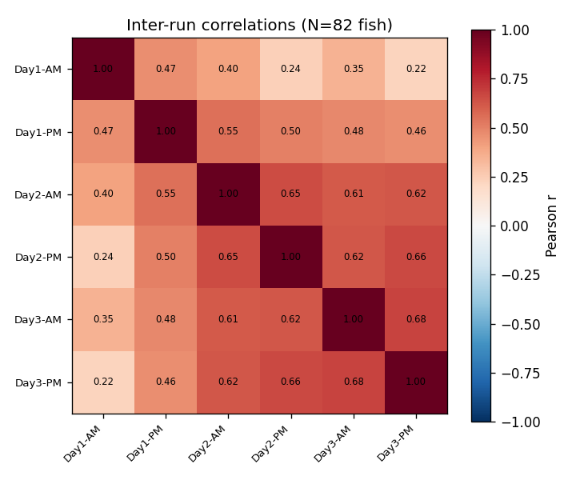
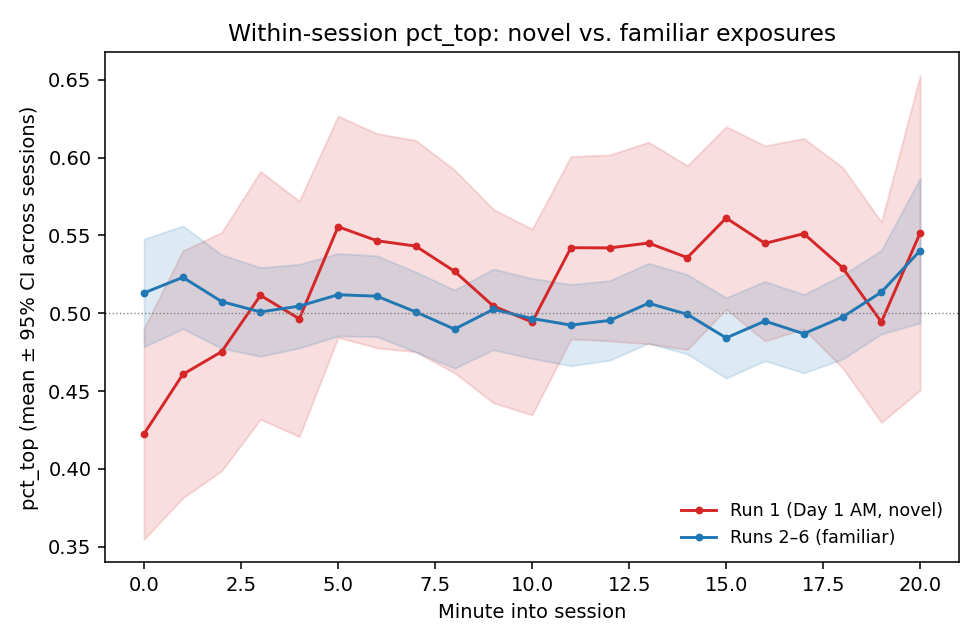

# Results

We reanalyzed a novel-tank dataset of 103 adult zebrafish tested six times over three days (two sessions/day; runs 1, 3, 5 = morning, runs 2, 4, 6 = afternoon). After applying the original study's 35 quality-control exclusions, 589 fish × session records remained, with 82 fish providing complete data across all six runs. The primary measure was top-half occupancy (pct_top), the proportion of detected frames spent in the upper half of the tank (higher = more exploration, less anxiety-like behavior). The pipeline began from the same distortion-corrected tracking output as our earlier Mathematica analysis, so the first step is a check that the new implementation reproduces the original result before extending it.

## The new pipeline reproduces the original reliability, expressed as single-measure R

Across the six sessions, pct_top showed high internal consistency (Cronbach's α = 0.855, 95% CI [0.801, 0.899]; α = 0.874 after adjusting for a small residual frame-position gradient), reproducing our earlier Mathematica analysis's α ≈ 0.88. The new pipeline is therefore a faithful re-implementation, and the small residual gap is attributable to differences in missing-frame interpolation (the original used carry-forward of the last detected position, the new pipeline bounded linear interpolation between bracketing detections; Methods).

Because α is a six-session *composite* reliability and is not directly comparable to the single-measure repeatability *R* reported across the animal-personality literature, we also estimated *R* = V~among~ / (V~among~ + V~within~) by variance partitioning (Table 1). Single-session repeatability was *R* = 0.50 (one-way ICC, complete cases; identical via one-way ANOVA on all 589 sessions and via a mixed model). Projecting this single-session *R* to a six-session composite by the Spearman–Brown formula returns 0.856, reproducing the observed α almost exactly: the high α is the arithmetic consequence of averaging six sessions, not an anomalously reliable single measurement. Placed against published single-measure benchmarks — nearly all from much longer intervals [@bell2009 lab mean *R* ≈ 0.37; @thomson2020 bottom-time *R* = 0.39; @baker2018 swim-speed *R* = 0.40–0.59; @johnson2025 lower-zone *r* = 0.29] — pct_top sits at the upper end of the typical range; a short, within-days interval is expected to yield higher repeatability than the weeks-to-months intervals of those studies.

A nested variance decomposition (pct_top ~ 1 + (1|batch) + (1|fish-within-batch)) attributed only 1.9% of total variance in pct_top to batch, versus 49.8% to stable among-individual differences and 48.2% to within-individual variation, so the reliability estimate is not materially inflated by batch structure [@shishis2022].

Three robustness points bear on this estimate. The Spearman–Brown step from single-session *R* to a six-session composite formally assumes parallel sessions, which Run 1 violates (below); this is one reason we report the more nearly parallel runs-2–6 estimate separately, and the close match between the predicted composite (0.856) and the observed α (0.855) shows the approximation is adequate here. Conditioning on session as a fixed effect — a *consistency* repeatability that removes any systematic run-to-run mean structure — leaves the estimate essentially unchanged (*R* = 0.52 vs. 0.51), so temporal drift in the mean does not inflate it; and because the confidence intervals are cluster-bootstrapped over fish, they already respect the non-independence of sessions within an individual. Finally, the pooled estimate is not an artifact of mixing the two strains: computed separately, single-session repeatability was *R* = 0.47 (5G) and *R* = 0.54 (AB), bracketing the pooled 0.51, so the strains have similar reliability even though their means cannot be compared (Methods; `src/11_qc_checks.py`).

**Table 1.** Reliability of pct_top, all runs versus the familiar-tank sessions (runs 2–6). *R* is the single-measure repeatability V~among~/(V~among~+V~within~); α is the *k*-session composite (Cronbach). Spearman–Brown projects the single-session *R* to a six-session composite. Confidence intervals are cluster-bootstrap (ICC) or analytic (ANOVA).

| Estimand | Method | Value | 95% CI |
|---|---|---|---|
| Composite reliability, all 6 runs | Cronbach's α (n = 82) | 0.855 | [0.801, 0.899] |
| Composite reliability, slot-adjusted | Cronbach's α | 0.874 | — |
| Single-session *R*, all runs | one-way ICC (n = 82) | 0.498 | [0.378, 0.593] |
| Single-session *R*, all runs | one-way ANOVA (589 sessions) | 0.511 | [0.409, 0.598] |
| Single-session *R*, runs 2–6 | one-way ICC | 0.586 | [0.478, 0.670] |
| Composite reliability, runs 2–6 | Cronbach's α | 0.876 | — |
| Single *R* → 6-session composite | Spearman–Brown | 0.856 | — |
| Batch share of total variance | nested mixed model | 1.9% | — |

## The first exposure is distinct, and reliability strengthens after the first day

The inter-run correlation structure (Figure 1; mean inter-run *r* = 0.50) shows that reliability is carried by the familiar-tank sessions: every pairwise correlation among runs 2–6 (*r* = 0.46–0.68) exceeds the correlation between Run 1 and any later run (*r* = 0.22–0.47).

{width=70%}

**Figure 1.** Pearson correlations of pct_top between all pairs of the six sessions (*n* = 82 fish with complete data). The first session (Day 1 AM, Run 1) correlates weakly with every other session, whereas runs 2–6 intercorrelate strongly.

Restricting the analysis to the familiar-tank sessions (runs 2–6) raised single-measure repeatability from *R* = 0.50 to *R* = 0.59 (95% CI [0.478, 0.670]) and α from 0.855 to 0.876 (Table 1). This gain was not produced by removing a population-level mean shift: the among-run mean of pct_top was essentially flat (run 1 = 0.518; runs 2–6 = 0.498), so the agreement and consistency repeatabilities were nearly identical. The flat among-run mean does not, however, imply that the assay failed to elicit a novelty response: *within* Run 1 the classic dive-then-explore trajectory is present, with pct_top rising from 0.42 in the first minute to 0.55 by minute 20, whereas Runs 2–6 are flat within-session (Figure 2) — the among-run mean is flat only because Run 1's 20-minute average coincides with the later sessions'. The Run 1 effect is instead an individual-level *reordering*: Run 1 ranks fish differently from the familiar-tank sessions (*r*(Run 1, mean of runs 2–6) = 0.41, versus a mean of 0.58 among runs 2–6). To avoid any appearance of selecting the higher value, we report the all-six-run *R* = 0.50 as the **primary** estimate and the runs-2–6 *R* = 0.59 as a **secondary, familiar-tank** estimate motivated *a priori* by the novelty/acclimation distinction. This pattern matches @thomson2020, who found week-1-to-2 repeatability far below later intervals and interpreted it as fish requiring one tank experience before behavior stabilizes.

{width=72%}

**Figure 2.** Within-session pct_top by minute, pooled across fish, for the novel first exposure (Run 1) versus the familiar re-exposures (Runs 2–6); bands are 95% CIs across sessions. Run 1 shows the expected dive-then-explore rise (0.42 → 0.55); the re-exposures are flat. The shallow initial dive (≈ 0.42, rather than the ≈ 0.20–0.30 of a strongly anxious cohort) indicates a modest anxiogenic response, which the freezing-blind tracker further understates (Methods).

The same first-day effect appears in the temporal structure of reliability. **Within-day** agreement between the morning and afternoon sessions rose across the three days — *r* = 0.47 (Day 1), 0.65 (Day 2), 0.68 (Day 3) — so a fish's two same-day measurements became more concordant once the tank was familiar. **Day-to-day** reliability across the three days, by ICC(A,1), was lower for the morning sessions (which include the Run 1 novel exposure: ICC = 0.45, 95% CI [0.32, 0.58]) than for the afternoon sessions (ICC = 0.54, [0.42, 0.66]). Both are moderate, as expected when aggregating run-to-run correlations in the 0.4–0.7 range, and both are dragged down chiefly by the first exposure rather than by a morning–afternoon difference per se. Practically, behavior in this assay is reliable from the first familiar session onward, but the very first exposure should not be pooled with it.

## Reliability across the measure battery

Repeatability is not confined to pct_top. We computed four additional session-level measures — latency to first top entry, top↔bottom transition count, within-session lateral-position SD (x_sd), and mean swimming velocity — and estimated the single-session and six-session reliability of each (Table 2). Lateral movement range (x_sd) and swimming velocity were as repeatable as pct_top itself (single-session *R* ≈ 0.51–0.52), establishing them as reliably repeatable over the short term; transition frequency was moderately repeatable (*R* = 0.38) and latency to first ascent least (*R* = 0.33). These measures are not redundant with pct_top — they index distinct aspects of the response (vertical position, locomotor activity, and initial latency) and differ in how reliably they do so — so a study reporting only top-half occupancy discards reliable, complementary information.

**Table 2.** Reliability of five novel-tank measures. *R* = single-session repeatability (one-way ANOVA, all sessions); α = six-session composite reliability (complete cases, *n* = 82). pct_top is computed over interpolated frames; latency, transitions, and velocity are movement-conditional (Methods).

| Measure | *R* (single-session) | α (6-session) |
|---|---|---|
| pct_top (top-half occupancy) | 0.511 | 0.855 |
| x_sd (lateral movement range) | 0.521 | 0.860 |
| velocity (swim speed) | 0.514 | 0.828 |
| transitions (zone crossings) | 0.376 | 0.764 |
| latency (to first top entry) | 0.327 | 0.533 |

## Summary

This reanalysis (i) confirms our earlier reliability result with a newly written pipeline (α = 0.855 ≈ original 0.88) and re-expresses it in the field's standard single-measure currency (primary single-session *R* ≈ 0.50; familiar-tank sensitivity estimate *R* ≈ 0.59), showing via Spearman–Brown that the high composite α and the single-session *R* are the same fact on different scales; (ii) shows the first, novel exposure measures a distinct, weakly reproducible response, with within-day and day-to-day reliability both strengthening after the first day; and (iii) finds that lateral movement and swimming speed are as reliable over the short term as the conventional pct_top measure, while transitions and especially latency are less so.
